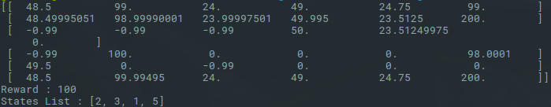
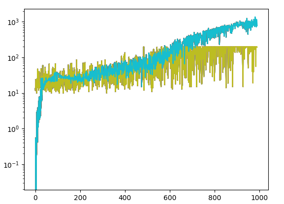

# Reinforcement_Learning

Q learning :

DQN (Cartpole) :

Here is the value of the Q fonction and the real reward foreach iteration.
The neural net learns in 600 iterations since the reward can't be higher than 200.

